# Relatório de Análise de Experimentos de Aprendizado por Reforço Profundo

# Introdução

Este relatório apresenta uma análise dos experimentos realizados com os métodos de Aprendizado por Reforço Profundo (Deep Q-learning e Double Deep Q-learning) em diferentes contextos. Foram utilizados ambientes do Classic Control do Gymnasium e ambientes do Atari para avaliar o desempenho dos algoritmos. A análise experimental considera o projeto das redes neurais, hiperparâmetros, métodos de otimização e critérios de parada utilizados em cada experimento.

# Ambientes e Configurações

Diversos variações houveram porém as melhores seja para o Cart pole ou seja para o mountain car se mantiveram nas mesmas configurações.
## Ambiente 1: Mountain Car
- Rede Neural: Camadas lineares com o PyTorch.
- Topologia da Rede: 
    - Camada com entrada do tamanho do input e saída de 128 neurônios e ativação relu.
    - Camada com entrada de 128 e saída de 128 neurônios e ativação relu.
    - Camada com entrada de 128 e saída com tamanho do output e ativação relu.
- Método de Otimização: Adam
- Hiperparâmetros: 
    - Episódios : 10000
    - Episilion inicial/final: 1/0.05
    - Learning Rate: 0.0001
    - Discount Factor: 0.99
    - Double Q ? Sim
- Critérios de Parada: Nenhum

### 10% do treinamento

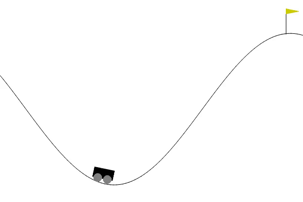  

### 50% do treinamento

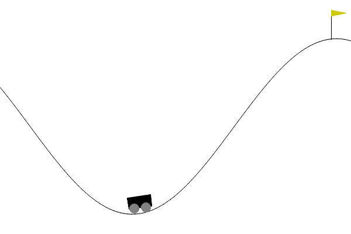  

### Final do Treinamento

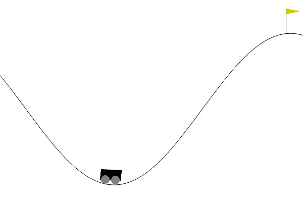  

### Gráficos do Resultado

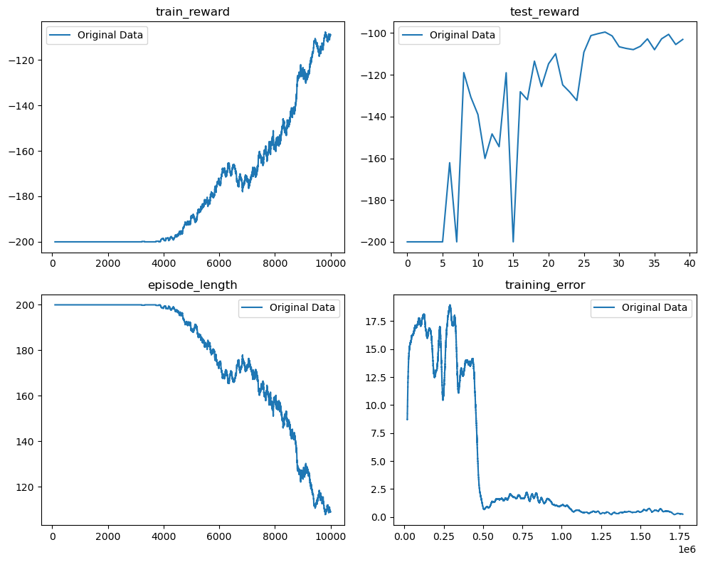       

Ao analisar o desempenho do modelo Double Deep Q-learning no ambiente Mountain Car, observamos uma grande mudança no início do treinamento, com alta variabilidade e exploração. No entanto, na segunda metade do treinamento, o desempenho aparenta estabilizar apesar de pelos gif não ser possível observar uma mudança significativa de estratégia, evidenciando uma melhoria na estabilidade e na capacidade de obter recompensas mais altas.Vale ressaltar que essa análise é relevante considerando que o modelo utilizado é o Double Deep Q-learning.

Em ordem os próximos 2 melhores depois dessa configuração foi:
- Mesmas configurações apenas sem ser Double Q Learning. Test Reward: -117
- Com Learning Rate de 0.01 e Episilon Final de 0.01. Test Reward: -169

### Ambiente 2: Car Pole
- Rede Neural: Camadas lineares com o PyTorch.
- Topologia da Rede: 
    - Camada com entrada do tamanho do input e saída de 128 neurônios e ativação relu.
    - Camada com entrada de 128 e saída de 128 neurônios e ativação relu.
    - Camada com entrada de 128 e saída com tamanho do output e ativação relu.
- Método de Otimização: Adam
- Hiperparâmetros: 
    - Episódios : 10000
    - Episilion inicial/final: 1/0.05
    - Learning Rate: 0.0001
    - Discount Factor: 0.99
    - Double Q ? Sim
- Critérios de Parada: Nenhum

### 10% do treinamento

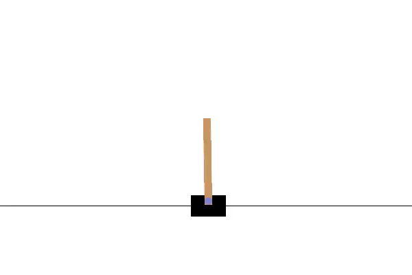  

### 50% do treinamento

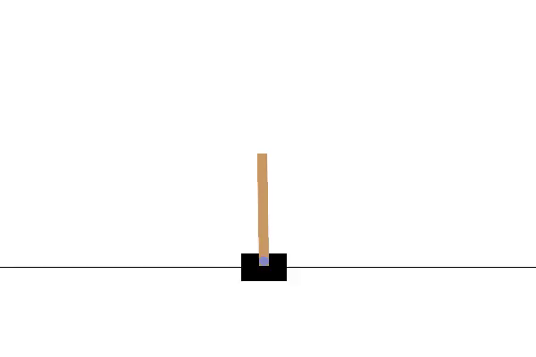  

### Final do Treinamento

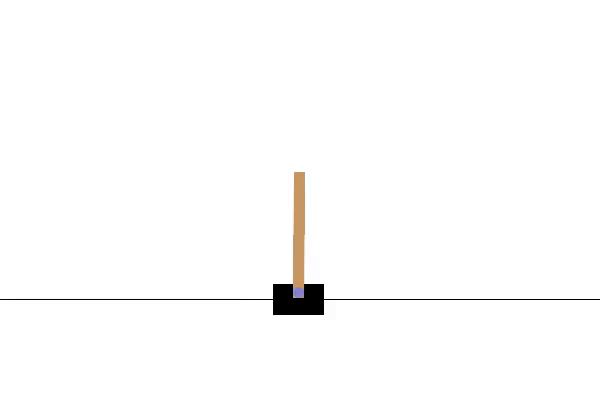 

### Gráficos do Resultado

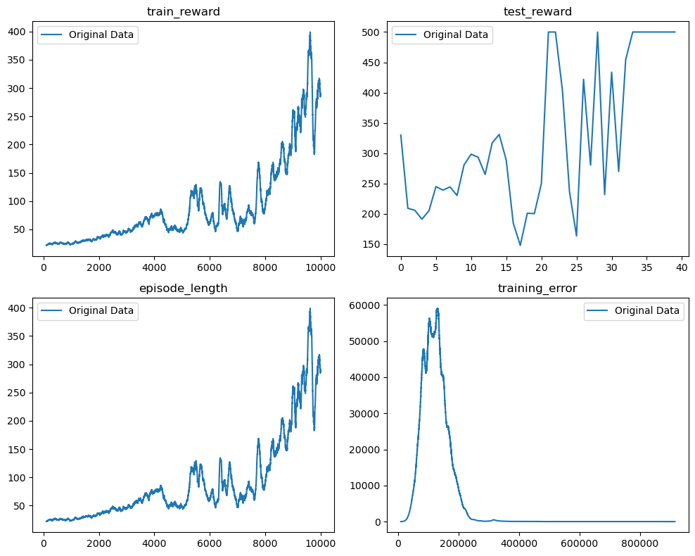   

No ambiente do Cart Pole, utilizando o modelo Double Deep Q-learning, foi observada uma melhora significativa no desempenho do agente a partir da metade do treinamento até o final. Essa evolução mais acentuada indica que o agente alcançou um ponto crítico de aprendizado, onde suas decisões e ações se tornaram mais consistentes e eficazes. Isso pode ser atribuído à capacidade do modelo em explorar estratégias melhores para maximizar as recompensas nesse ambiente específico.

Em ordem os próximos 2 melhores depois dessa configuração foi:
-  Com Learning Rate de 0.01 e Episilon Final de 0.01. Test Reward: 280
-  Com Learning Rate de 0.01 e Episilon Final de 0.01 sem ser Double Q. Test Reward: 141

## Ambientes do Atari
Os ambientes do Atari foram executados em computação em nuvem, utilizando recursos com acesso a GPU, como o Google Colab e Kaggle. No entanto, esses ambientes possuem um limite na quantidade de GPU disponível, o que representou um grande desafio neste trabalho. Em virtude dessa limitação, apresentaremos o melhor resultado obtido no Space Invaders, considerando o tempo de execução de cada teste.

### Ambiente 3: Space Invaders
- Hiperparâmetros: 
    - Episódios : 3000
    - Episilion inicial/final: 1/0.3
    - Learning Rate: 0.0001
    - Discount Factor: 0.99
    - Batch Size: 128
    - Double Q ? Não
- Critérios de Parada: Nenhum

### Tratamento de imagem

O tratamento de imagem realizado pela função preprocess_frame consiste em várias etapas para preparar a imagem do jogo antes de ser utilizada pelo modelo de aprendizado por reforço. Essas etapas são as seguintes:

**Conversão para Preto e Branco (Escala de Cinza)**: O primeiro passo é converter a imagem RGB em uma imagem em escala de cinza, reduzindo a complexidade da imagem para um único canal de intensidade luminosa.

**Recorte (Cropping)**: Uma região específica da imagem é recortada para eliminar informações irrelevantes ou áreas que não afetam diretamente o comportamento do agente. As regiões a serem cortadas são definidas pelo parâmetro exclude, que indica as coordenadas de corte (UP, RIGHT, DOWN, LEFT) da imagem.

**Remoção de Duplicatas Consecutivas (Consecutive Duplicates Removal)**: Colunas e linhas duplicadas em sequência na imagem são removidas. Isso pode ser necessário para reduzir o tamanho da imagem, evitando redundância de informações e economizando recursos computacionais durante o treinamento.

**Redimensionamento (Resizing)**: A imagem é redimensionada para um tamanho específico (84x84), que é o tamanho de saída esperado para ser usado como entrada para o modelo de aprendizado por reforço. O redimensionamento padrão é realizado usando a técnica de interpolação bilinear.

**Normalização**: A imagem é convertida em um array numpy e normalizada para valores no intervalo [0, 1], dividindo cada pixel por 255 (valor máximo de intensidade em imagens RGB).

Veja abaixo como ficou o antes e depois do tratamento da imagem:

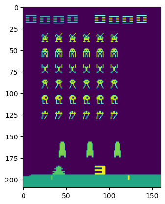   
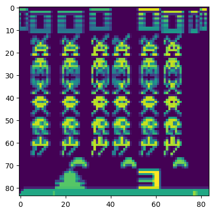   

### Rede
No ambiente do Space Invaders, foi utilizada uma rede neural com arquitetura composta por camadas convolucionais, seguida por uma camada linear, para fins de Deep Q-learning. A seguir, descrevo a estrutura da rede:

#### Rede Neural Convolutiva
- A camada de convolução 1:
    - Número de canais de entrada: `input_shape[0]` (o número de canais de entrada corresponde ao primeiro valor da dimensão `input_shape` da imagem de entrada).
    - Número de canais de saída: 6.
    - Tamanho do kernel: 5x5.
    - Função de ativação: Tangente hiperbólica (Tanh).
    - Operação de amostragem: Média (AvgPool2d) com kernel de tamanho 2x2 e stride de 2.

- A camada de convolução 2:
    - Número de canais de entrada: 6.
    - Número de canais de saída: 16.
    - Tamanho do kernel: 5x5.
    - Função de ativação: Tangente hiperbólica (Tanh).
    - Operação de amostragem: Média (AvgPool2d) com kernel de tamanho 2x2 e stride de 2.

#### Rede Neural Linear (Cabeça da Rede)
Após as camadas convolucionais, a rede possui uma camada linear que recebe o output das convoluções e o redimensiona para um vetor linear. A saída dessa camada é conectada a outra rede neural chamada `LinearNetwork`, que utiliza a seguinte estrutura:

- Camadas lineares:
    1. Camada de entrada com tamanho `linear_input_size` (calculado pela função `layers_size()`).
    2. Camada oculta com 512 unidades.
    3. Função de ativação: ReLU.
    4. Camada oculta com 512 unidades.
    5. Função de ativação: ReLU.
    6. Camada de saída com tamanho `action_space_n` (número de ações possíveis no ambiente do Space Invaders).

A arquitetura combina camadas convolucionais para capturar características visuais e, em seguida, redimensiona a saída para alimentar a rede neural linear, que mapeia as características extraídas para as ações disponíveis no ambiente.

Essa estrutura foi projetada especificamente para o ambiente do Space Invaders, buscando extrair informações relevantes da imagem do jogo e permitir a tomada de decisões adequadas para maximizar as recompensas ao longo do treinamento.

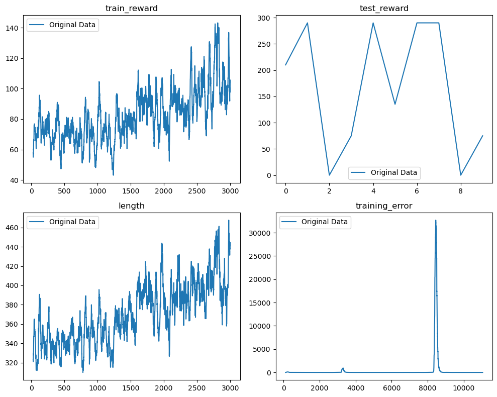   

No ambiente do Atari Space Invaders, os resultados obtidos foram inconclusivos, apesar de um aumento notável na recompensa ao longo do treinamento em análise a longo prazo. No entanto, esse aumento ainda não foi suficiente para atingir o desempenho desejado. Diante dessa situação, é evidente que será necessário estender o tempo de treinamento além do limite de GPU disponível pelas plataformas mencionadas anteriormente.

O aumento do tempo de treinamento é uma abordagem comum para permitir que o agente continue a aprender e explore estratégias mais avançadas, podendo levar a resultados mais promissores e ao aprimoramento do desempenho em tarefas complexas como o Space Invaders.

Porém, é importante ressaltar que o aumento do tempo de treinamento também pode exigir recursos adicionais, como maior capacidade de GPU e poder computacional, e pode levar a limitações práticas em termos de custos e tempo. Portanto, é necessário equilibrar a extensão do tempo de treinamento com a disponibilidade dos recursos adequados.

Além disso, outras técnicas e abordagens podem ser exploradas para melhorar o desempenho do agente, como ajuste de hiperparâmetros, uso de arquiteturas mais sofisticadas de rede neural, técnicas de otimização avançadas, entre outras. O processo de aprimorar o aprendizado por reforço em ambientes complexos como o Space Invaders envolve a busca contínua por soluções mais eficazes e a exploração de diferentes estratégias de treinamento e modelagem.
